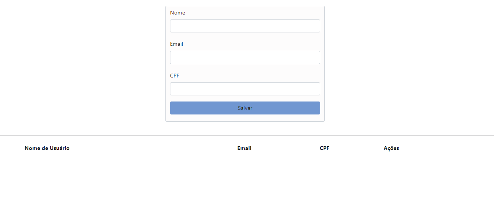

    

<h1 style="font-family: Arial; margin-top: 20px;">Introduction</h1>

<h3>This project aims to create a user registration system using JavaScript. In it, the user's name will be inserted into a table to facilitate data management and visualization.</h3>
<h3>Functions in JavaScript play a crucial role in interacting with tables on a web page, making the application more dynamic and functional. They allow data to be entered, manipulated and displayed in the table efficiently and interactively. Therefore, the project will have the following functions:</h3>

 - [x] email login and password
 - [x] Redirect to registration
 - [x] Registration of Name, Email, Password and CPF
 - [x] Data interface through table
 - [x] Delete and edit in real time

<h1>Development</h1> 

<h2> Neste capítulo será apresentada as funções em JavaScript que se relacionam com a experiência do usuário de tal forma que a muda para uma maneira mais dinâmica e funcional.</h2>

<h2> 1. Function "Acessar"</h2>

#### This function checks whether the email and password fields are filled in and, if so, redirects the user to another page. Otherwise, it displays a message asking you to fill in all the fields.

<h2> 2. Function "salvarUser"</h2>

#### Este código permite que o usuário insira um nome em um campo de texto. Se o nome for fornecido, ele é salvo em uma lista e a interface é atualizada para refletir o novo dado. Se o campo estiver vazio, o usuário recebe um alerta pedindo para inserir um nome.

<h2> 3. Function "criaLista"</h2>

#### This createList() function dynamically generates an HTML table that lists all usernames stored in dataList. It also adds "Edit" and "Delete" buttons for each row, allowing the user to interact with the data directly in the table, making the page more interactive and functional.

<h2> 4. Function "Editar Nomes"</h2>

#### The edit function is a tool for modifying a list of names, allowing you to select a name, edit it in a text field, and update the original list with the new information.

<h2> 5. Função "Excluir Nomes"</h2> 

#### The delete function is like scissors for lists and tables. You indicate which item you want to cut (by index) and it removes it from both the internal list (where the data is stored) and the visual table (where the user sees the list).

#### This function is very common in web applications that allow users to manage lists of items, such as to-do lists, contacts, products in a shopping cart, etc. When clicking a "Delete" button next to an item, this function would be called to remove the item from the list and interface.

<h1>Conclusions</h1>

### A web application that allows the user to create a table with names entered by him, with deletion and editing functionalities, an application like this offers a simple and intuitive interface for the user to manage a list of names, providing the basic functionalities of editing and delete.

<h1> Implementação de validação do CPF </h1>

#### Este código JavaScript valida a entrada de um CPF e fornece feedback ao usuário. Ele verifica primeiro se um CPF foi inserido e, em seguida, utiliza a função "validarCPF" para determinar sua validade. Se o CPF for inválido, uma mensagem em vermelho é exibida; se for válido, a mensagem aparece em verde. O uso de cores e mensagens claras melhora a experiência do usuário, garantindo que erros de entrada sejam tratados adequadamente.

# Results

# Technologies Used

### [HTML5](https://html.spec.whatwg.org/)
### [JavaScript](https://developer.mozilla.org/pt-BR/docs/Web/JavaScript)
### [BootStrap 5](https://getbootstrap.com/docs/5.0/getting-started/introduction/)
### [Adobe Express](https://www.adobe.com/br/express/)
### [Padlet](https://padlet.com/victorevangelista153/meu-padlet-diferenciado-pblfh23dlv5iaoi1)
### [Canva](https://www.canva.com/pt_br/)
### [Mdn Docs](https://developer.mozilla.org/pt-BR/docs/Web/HTML)